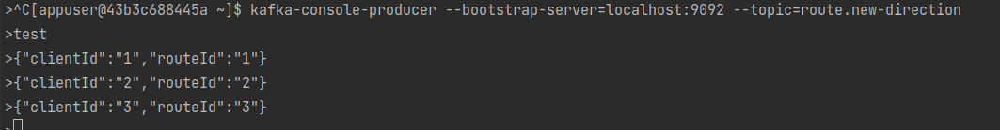
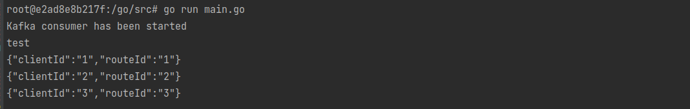
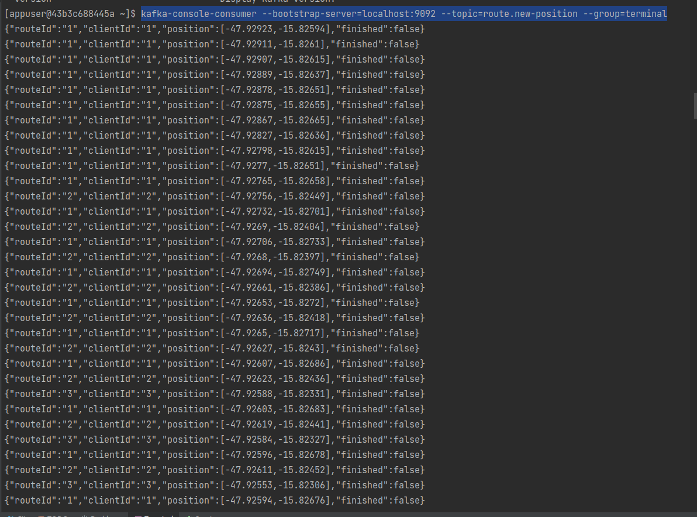

  <a href="#-tecnologias">Tecnologias</a>&nbsp;&nbsp;&nbsp;|&nbsp;&nbsp;&nbsp;
  <a href="#-projeto">Projeto</a>&nbsp;&nbsp;&nbsp;|&nbsp;&nbsp;&nbsp;
  <a href="#-como-rodar">Como rodar</a>&nbsp;&nbsp;&nbsp;|&nbsp;&nbsp;&nbsp;
  <a href="#-como-contribuir">Como contribuir</a>&nbsp;&nbsp;&nbsp;
  

 

## Full Cycle - Simulador Go

  

  

  

## 🚀 Tecnologias

Esse projeto foi desenvolvido com as seguintes tecnologias:

- [Docker](https://www.docker.com/)
- [Kafka](https://kafka.apache.org/)
- [Go](https://go.dev/)

## 💻 Projeto

Simulador para gerar posições no map (latitude e longitude).

## 🚀 Como Rodar

- Clone o projeto.
- crie um arquivo .env na raiz do projeto com os valores que estão em .env.example
- Entre na pasta do projeto e rode `docker-compose up -d`.
- Entre no container com o comando `docker exec -it simulator bash`. Quando entrar execute o comando `go run main.go`. Esse terminal estará escutando as mensagens.
- Entre no container com o comando `docker exec -it kafka_kafka_1 bash`. Esse terminal será do producer (responsavel por enviar as mensagens), digite o comando  `kafka-console-producer --bootstrap-server=localhost:9092 --topic=route.new-direction`. É aqui que enviaremos as mensagens.
- Entre no container com o comando `docker exec -it kafka_kafka_1 bash`. Esse terminal será do consumer (responsavel por preencher as mensagens), digite o comando  `kafka-console-consumer --bootstrap-server=localhost:9092 --topic=route.new-position --group=terminal`.

## 🤔 Como contribuir

- Faça um fork desse repositório;
- Cria uma branch com a sua feature: `git checkout -b minha-feature`;
- Faça commit das suas alterações: `git commit -m 'feat: Minha nova feature'`;
- Faça push para a sua branch: `git push origin minha-feature`.

Depois que o merge da sua pull request for feito, você pode deletar a sua branch.

## 📝 Licença

Esse projeto está sob a licença MIT.
